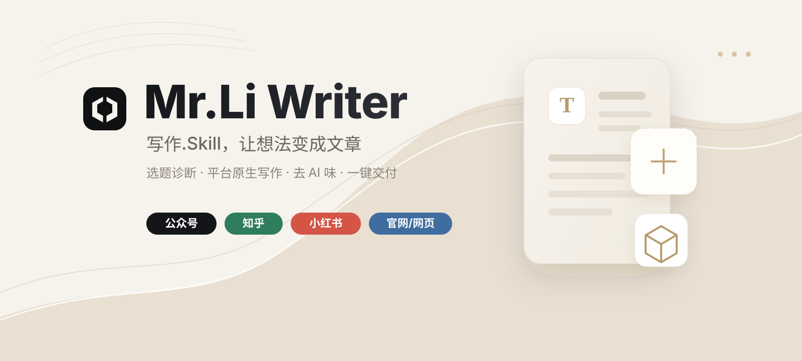

<p align="center">
  
</p>

# Mr.Li Writer

[](LICENSE)


## 20 秒看懂核心特点

如果你想先快速了解这个 Skill 解决什么问题、从哪里形成差异、适合怎么用，可以先看这个 [20 秒视频](https://raw.githubusercontent.com/NocodeMrLi/mr-li-writer-skill/main/assets/mr-li-writer-promo-silent.mp4)。

https://github.com/user-attachments/assets/0463a2b6-1edc-4bb8-98d6-99afe89bdc4c

<sub>视频仅用于说明本项目已写入README的定位、特点和使用边界。</sub>

一个从模糊想法走到平台原生交付的中文写作 Skill。

只需提供一个标题、核心想法、零散素材或参考资料，它会先识别读者任务、材料条件和创新是否必要，再生成适合公众号、知乎、小红书、官网/网页和个人博客的平台原生内容。

> It identifies the reader's job, checks the material basis, applies only the innovation the topic needs, then creates platform-native Chinese content.

Mr.Li Writer 不是拼装式提示词，也不是把一篇长文缩短后分发到所有平台。它以本项目原创的编辑路由为主线，把读者任务、材料条件、创新必要性、体裁结构、标题承诺、平台表达、去 AI 味修改和真实文件交付连成一套可验证的写作系统。

---

## 适合谁

- 公众号、知乎、小红书、官网/网页、个人博客和个人 IP 内容创作者
- 需要把零散想法整理成完整文章的人
- 希望文章自然、有判断、不像 AI 生成稿的人
- 想节省资料检索、选题判断和标题策划时间的人
- 需要把 DOCX、PDF、图片或链接素材整理成可发布内容的人

---

## 能做什么

- **编辑路由**：先识别读者要找答案、做选择、避风险、学方法、被理解还是看故事，再决定文章需要多深
- **最低必要创新**：可直接写清楚的题不强行升维；确有同质化风险时，再从微创新、视角转换或概念创新中选择合适档位
- **开头设计**：拒绝"后台有人问""随着……发展"等模板化开头，为每篇文章设计专属入口
- **标题策划**：先建立标题对读者的点击契约，兼顾此刻相关性、理解成本、自然口语感和平台特性，不编造数据、不做标题党
- **平台原生写作**：公众号写成文章，知乎写成回答 / 专栏，小红书写成原生笔记，官网/网页写成结构化网页内容
- **正向活人感写作**：先明确说话位置、现实与虚构边界和材料取舍，再检查每段是否新增事实、动作、区分、推理或后果
- **去 AI 味写作**：至少经过两轮检查与直接改写，处理套话、重复结构、虚构经历、机械翻案和不匹配的证据腔
- **来源控制**：硬信息优先使用官方一手资料，避免把利益相关培训或服务机构写成正文背书
- **交付口径清理**：保留必要来源和时间备注，但不把抓取、爬取、检索结果、AI 生成等后台动作写进正文
- **多体裁覆盖**：支持公众号深度文、知乎回答、小红书笔记、行业解读、实用指南、情感生活等
- **平台化交付**：公众号使用完整组件库式内联 HTML 排版，小红书使用手机笔记卡片，官网/网页和博客使用对应预览
- **跨端稳定排版**：公众号目录、标题、金句和表格按 PC/手机预览自适应，短句可居中，长段落自然左对齐
- **读者端口径清洁**：前端标签使用“实用指南、判断参考、避坑提醒”等读者语言，避免暴露后台生产词和编辑立场词
- **可靠文件交付**：公众号固定四件套，其他平台按原生发布方式决定两件或四件；优先使用宿主原生附件或文件卡片发送真实文件

---

## 项目特点

### 1. 先做编辑判断，不让流程替代判断

同一个主题不一定需要立意创新。系统先判断读者是找答案、做选择、避风险、学方法、被理解还是看故事，再选择直给、微创新、视角转换或概念创新。能直接解决问题时就直接写，不为了显得深刻增加理解成本。

### 2. 创新有成本，也有停止条件

“最低必要创新”是本项目的核心原则。新角度只有在读者收益、材料支撑和平台价值都增加时才成立；标题优先兑现点击契约，而不是用陌生概念制造表面差异。

### 3. 活人感来自位置、材料和取舍

系统不会靠错别字、假口语或虚构经历伪装真人。它会先明确谁在说、凭什么说、哪些地方不知道，再检查每段是否增加了事实、动作、区分、推理或后果，并通过至少两轮“检查后直接修改”完成交付。

### 4. 同一想法会被写成不同平台的原生内容

公众号重文章节奏和富文本排版，知乎重结论、边界与反例，小红书重短段、收藏价值和纯文本发布，官网/网页重结构化 HTML 与搜索目标，博客保留作者声音与长期阅读。平台不是文章末尾才添加的格式参数。

### 5. 研究过程不会污染读者正文

硬信息优先核对官方来源，第三方资料只在合适边界内辅助判断。正文保留来源、时点和不确定性，但不会出现“抓取、爬取、模型生成、提示词”等后台动作，也不会把利益相关机构写成无关宣传。

### 6. 写作到交付闭环

项目不止生成文字，还校验标题策略、平台原文、HTML、复制预览和宿主附件是否真实存在。交付数量由平台属性决定：该排版时完整排版，不需要排版时不机械凑四件套。

---

## 安装

选择一个宿主能够发现的 Skills 目录进行安装。通用 Agent Skills 目录：

```bash
mkdir -p ~/.agents/skills
git clone https://github.com/NocodeMrLi/mr-li-writer-skill.git ~/.agents/skills/mr-li-writer
```

Codex 专用目录：

```bash
mkdir -p ~/.codex/skills
git clone https://github.com/NocodeMrLi/mr-li-writer-skill.git ~/.codex/skills/mr-li-writer
```

已经安装时，可以在对应目录更新：

```bash
git -C ~/.agents/skills/mr-li-writer pull
git -C ~/.codex/skills/mr-li-writer pull
```

其他支持 `SKILL.md` 的宿主，请将仓库放入该宿主声明的用户级或项目级 Skills 目录。宿主需要具备联网检索能力才能完成全网对比研究；没有联网工具时，Skill 会基于用户提供的资料写作并保留事实边界。

---

## 快速开始

```text
使用 $mr-li-writer，我想写"[你的主题]"，帮我判断这个方向值不值得写，再给我更好的立意。
```

Codex 可使用 `$mr-li-writer` 调用；采用斜杠命令的宿主可尝试 `/mr-li-writer`，也可以直接用自然语言明确要求使用 Mr.Li Writer。

---

## 工作流程

1. 接收标题、想法、素材、文件或参考链接。
2. 建立编辑路由：确认读者任务、材料是否足够、创新档位和增强级别；默认采用最低必要创新。
3. 只有方向模糊、用户要求或同质化风险真实存在时，才进行两轮语境检索与方向校准。
4. 区分发布平台与内容目标，确认体裁、证据密度、说话位置和现实/虚构边界。
5. 设计标题的点击契约、开头、结构和正文，让每段持续增加信息或行动，不套用固定文章框架。
6. 完成至少两轮去 AI 味检查并直接修改，仍有明显问题时继续修正。
7. 按平台属性交付标题、原生正文和必要的排版文件；公众号固定四件套，其他平台不机械套用，并优先使用宿主原生附件。

---

## 使用示例

### 从一个模糊想法开始

```text
使用 $mr-li-writer，我想写"AI 会不会取代写作"，先帮我判断这个方向值不值得写，再给我更好的立意。
```

### 写公众号深度文

```text
使用 $mr-li-writer，写一篇公众号文章，主题是"为什么很多人越努力越焦虑"。
要求：先判断读者任务和创新是否必要，设计一个不套模板的开头，标题要适合公众号推送，正文去 AI 味、有判断，最后生成 HTML。
```

### 写知乎回答

```text
使用 $mr-li-writer，写一篇知乎回答：如何判断一个证书是否值得考？
目标读者：职场新人。
要求：开头要有代入感不要模板化，有检索、有反方、有选择标准，标题不要标题党。
```

### 写小红书笔记

```text
使用 $mr-li-writer，写一篇小红书笔记，主题是"新手第一次买空气炸锅怎么选"。
要求：不要写公众号长文，要像小红书原生笔记，有短标题、短段落、emoji 提示、适合谁/不适合谁、避坑清单和 6-10 个话题标签。
```

### 写情感生活类文章

```text
使用 $mr-li-writer，写一篇"夫妻之间的保鲜剂"。
要求：开头用真实生活场景切入不要套话，正文不要大篇幅数据和专家，重点写具体场景、关系判断和可执行的小动作，语气去 AI 味。
```

### 基于素材二次创作

```text
使用 $mr-li-writer，基于我提供的 DOCX 和参考链接，整理成一篇公众号文章。
要求：保留必要事实，去掉宣传腔，重新设计开头和标题，正文去 AI 味，最后生成 HTML 排版。
```

---

## 建议提供的信息

越明确，输出越贴近你的目标：

- 目标读者和发布平台
- 内容目标：普通传播、GEO、SEO、转化销售或专业报告
- 想解决的问题或希望读者采取的行动
- 已有的核心观点、素材文件或参考链接
- 希望的文章气质：稳妥清晰、观点锋利、故事感更强、平台传播、高完成度深度
- 对开头风格的偏好（如直接、场景感、判断感）
- 标题的使用场景（如搜索、社交分发、公众号推送、小红书笔记标题）
- 是否允许出现品牌、公司、产品和人物名称
- 是否需要 Markdown、平台纯文本、SEO/GEO 元数据或单文件 HTML

---

## 发布平台与内容目标

推荐把“发在哪里”和“想达成什么”分开说：

发布平台：

- 公众号
- 知乎
- 小红书
- 官网/网页
- 个人博客

内容目标：

- 普通传播
- GEO / 生成式搜索优化
- SEO / 搜索引擎优化
- 转化销售
- 专业报告

例如：“发布平台：官网/网页；内容目标：SEO”比“写一篇 SEO 平台文章”更清楚。

---

## 平台交付样式

| 发布平台 | 平台原生正文 | 默认排版 | 默认文件交付 |
| :--- | :--- | :--- | :--- |
| 公众号 | Markdown 原稿 + 公众号富文本 | 必须 | 标题策略 + 正文原稿 + 干净 HTML + 复制预览 HTML |
| 知乎 | 回答 / 专栏 Markdown 或纯文本 | 不需要 | 标题策略 + 知乎原文；要求预览时增加两个 HTML |
| 小红书 | 可直接发布的纯文本笔记 | 不需要 | 标题策略 + 笔记原文；要求手机卡片时增加两个 HTML |
| 官网/网页 | Markdown 源稿 + 网页 HTML | 必须 | 标题策略 + 网页源稿 + 干净 HTML + 复制预览 HTML |
| 个人博客 | 取决于博客系统 | 条件式 | Markdown 博客默认两件；静态页或 HTML 发布时增加两个 HTML |

需要排版时，系统同时生成干净 HTML 和带复制功能的 HTML；不需要排版时，只交付符合平台的标题策略与原生正文，不机械凑四件套。用户手动指定交付样式时会尊重选择，但会提示明显不适配的平台风险。

选择知乎或小红书后，如果提示词里没有说明排版需求，Skill 会主动询问“是否需要 HTML 排版预览？”，并提前说明两种交付结果。用户已经明确选择，或明确说“不要询问、直接处理、自动匹配”时，才会跳过询问并按平台默认值执行，避免用户以为会有排版却只收到原文。

### 执行中会确认什么

Skill 采用最低必要询问，不会把每次写作变成问卷。用户已经说清的信息不重复问；同时缺少多个关键项时一次合并询问。

确认分三层：

- **必问**：发布平台、内容目标、创作方向、平台交付样式
- **条件问**：目标读者/阅读场景、立场边界、时效口径、来源边界、交付格式、篇幅深度
- **不默认问**：语气风格、开头方式、标题数量、是否要金句、是否要案例

不默认问不代表忽略，而是由 Skill 按平台、体裁和读者任务内部判断；用户主动指定时会尊重。

必问项与条件触发项是硬门禁：必问项缺失时不会直接写正文、排版或交付；条件问一旦被当前任务触发，也会先确认再继续。系统不会用推荐项、平台默认值或历史默认值替代用户确认，除非用户明确说“自动匹配 / 不用问 / 直接处理”。

| 场景 | 必要确认 |
| :--- | :--- |
| 未指定平台 | 内容最终发布到哪里 |
| 未指定内容目标 | 普通传播、SEO/GEO、转化销售还是专业报告 |
| 创作方向不明确 | 给 3-5 个方向候选，并标注【最推荐】【次推荐】 |
| 公众号 | 使用哪个排版主题；可接受系统推荐，但需要用户确认 |
| 知乎 | 写回答还是专栏；是否需要 HTML 排版预览 |
| 小红书 | 清爽纯文本笔记还是手机卡片预览；偏种草、避坑还是收藏清单 |
| 官网/网页 | 普通网页、SEO-GEO 结构化、转化落地页还是专业报告页；是否有 CMS/模板约束 |
| 个人博客 | 使用 Markdown、CMS 富文本、静态 HTML，还是博客长文风格 |

用户明确说“不要询问、直接处理、自动匹配”时，系统会按平台默认值继续，并在交付说明中写清实际选择。

当需要用户选择创作方向时，Skill 会给出 3-5 个候选，并标注【最推荐】和【次推荐】，帮助用户判断不同方向的读者任务、内容承诺和证据路径。

平台交付样式不是公众号专属。知乎、小红书、官网/网页和个人博客也会按平台属性确认对应样式；用户明确说“自动匹配 / 直接处理 / 不用问”时才自动选择。

### 中断后继续任务

如果任务因为 token、模型切换、上下文压缩或宿主中断而恢复，用户说“继续”“继续完成任务”时，Skill 会先检查必要信息是否已经确认。只要发布平台、内容目标、创作方向、平台交付样式或触发的条件问仍缺失，就会先补问，不会把“继续”当作默认授权直接写作或排版。

---

## 公众号排版主题

公众号排版是 Mr.Li Writer 写作到交付闭环中的一个专用模块。视觉组件在本项目的平台路由、正文清理、表格转换、跨端防溢出和交付校验基础上，采用 [gzh-design-skill](https://github.com/isjiamu/gzh-design-skill) 的 6 套主题资源。当前共接入 109 个组件，可生成公众号编辑器使用的内联 HTML，并同时生成带“复制到公众号”按钮的预览页。

| 主题标识 | 中文名 | 适合内容 |
| :--- | :--- | :--- |
| `moyu-green` | 摸鱼绿 | 教程、测评、清单、工具盘点 |
| `red-white` | 红白色系 | 深度分析、观点、力量感话题 |
| `graphite-minimal` | 石墨极简风 | 设计、科技评论、专业观点 |
| `zen-whitespace` | 留白禅意风 | 随笔、极简生活、沉静表达 |
| `moyu-ticket` | 摸鱼票据风 | 工具对比、创意评测 |
| `olive-journal` | 橄榄手记 | 案例复盘、内刊手记、系统说明 |

如果用户没有指定主题，系统会先推荐适合的公众号主题；用户明确说“直接排”“不用问”时才会自动匹配。正式生成公众号 HTML 时，脚本会要求使用已确认的具体主题并传入 `--theme-confirmed`；只有用户明确授权自动匹配，才允许使用 `--auto-theme-ok`。

公众号主题组件库位于：

```text
assets/gzh-design/references/
```

组件库覆盖封面、目录、章节标题、正文段落、引用、提示卡、标签、列表、数据/要点卡、图片、FAQ、时间线、作者签名和结尾互动等常用公众号排版区块。正式精排时会按文章类型选择对应主题和组件组合，而不是只做颜色替换。

---

## 脚本说明

核心脚本使用 Python 3 标准库即可运行；只有 DOCX、PDF 和图片素材提取需要下面列出的可选依赖。

### 素材提取

```bash
python3 scripts/extract_seed.py <file.docx|file.pdf|image.png>
python3 scripts/extract_seed.py <file.docx> --redact-term "需要隐藏的词"
```

依赖：`pip install python-docx pypdf rapidocr_onnxruntime`

### 正文质量检查

交付前自动检查：模板化表达、同质化开头、机械翻案、名词堆叠、句长过度整齐、虚构第一人称、段落是否缺少信息增量、证据密度是否匹配文章类型、是否缺少引用来源、是否暴露后台资料处理动作，以及是否把利益相关第三方机构写成正文背书等。检查结果必须用于直接修改，不以“已检查”代替修正。

```bash
python3 scripts/lint_article.py <article.md> --genre relationship-life --evidence-density low --impact-check
python3 scripts/lint_article.py <article.md> --genre policy-industry --evidence-density high --require-sources --impact-check
python3 scripts/lint_article.py <note.md> --platform 小红书 --mode xiaohongshu-note --genre platform-native --evidence-density low --impact-check
```

### 生成 HTML

```bash
python3 scripts/build_html.py <article.md> --list-themes
python3 scripts/build_html.py <article.md> --list-delivery-styles
python3 scripts/build_html.py <article.md> -o article-gzh.html --title "文章标题" --platform 公众号 -t red-white --theme-confirmed
python3 scripts/build_html.py <article.md> -o article-gzh.html --title "文章标题" --platform 公众号 -t auto --auto-theme-ok
python3 scripts/build_gzh_html.py <article.md> -o article-gzh.html --title "文章标题" -t moyu-green --theme-confirmed
python3 scripts/build_html.py <note.md> -o note.html --title "笔记标题" --mode xiaohongshu-note --platform 小红书 --emit-pair
python3 scripts/build_html.py <web.md> -o web.html --title "网页标题" --platform 官网/网页 --content-goal SEO --emit-pair
```

通用 HTML 支持 Markdown 图片语法，例如 ``，会转换为带说明文字的 `<figure><figcaption>` 结构。

一篇公众号文章必须交付四份文件：

- `title-strategy.md`：推荐标题、至少 2 个备选标题与选择理由
- `article-source.md`：可继续修改的 Markdown 正文
- `article-gzh.html`：用于校验和手动粘贴兜底的干净正文片段
- `article-preview.html`：浏览器打开后点击“复制到公众号”，再粘贴到公众号编辑器

公众号脚本会根据正文输出名自动生成预览页，例如 `article-gzh.html` 对应 `article-gzh_preview.html`；整理最终四件套时可统一命名为 `article-preview.html`。

公众号交付前会运行固定四件套校验，少任何一件都不会进入最终交付。其他平台先校验标题策略和平台原生正文；本次涉及排版时再用 `--layout` 要求干净 HTML 与复制预览 HTML。交付时优先使用宿主原生附件/文件卡片；宿主不支持时会如实说明能力边界，不把本地绝对路径包装成看似可点击的链接。

公众号组件库检查：

```bash
python3 scripts/gzh_component_inventory.py .
python3 scripts/component_lint.py .
python3 scripts/validate_gzh_html.py article-gzh.html
python3 scripts/validate_delivery_bundle.py ./delivery --platform 公众号
python3 scripts/validate_delivery_bundle.py ./delivery --platform 知乎
python3 scripts/validate_delivery_bundle.py ./delivery --platform 官网/网页 --layout
```

### 项目自检

```bash
python3 -m unittest discover -s tests -v
python3 -m py_compile scripts/*.py tests/test_regressions.py
python3 scripts/gzh_component_inventory.py .
python3 scripts/component_lint.py .
```

涉及写作规则升级时，还应使用 [编辑效果评测规范](references/editorial-evaluation-protocol.md) 和 12 个[跨体裁种子题](tests/fixtures/editorial-routing-cases.md)做盲评与同题多跑。评测同时关注点击意愿、任务完成度、理解成本、可信度、活人感、信息增量和平台原生度；没有实际评测数据时，不宣称写作效果已经得到证明。

公众号正文采用内联样式、固定表格布局、语义分行和容器内换行等兼容约束，并经过桌面与手机视口检查。短金句和公式会按语义分行，长解释段落会保持自然左对齐。前端标签会优先使用读者可理解的内容口径，避免把后台生产词、编辑立场词暴露到阅读端。微信公众号编辑器仍可能随版本调整过滤规则，重要文章发布前应在公众号后台分别完成手机端和 PC 端预览。

---

## 目录结构

```text
mr-li-writer-skill/
├── README.md
├── SKILL.md
├── LICENSE
├── NOTICE.md
├── agents/
├── references/
│   ├── delivery-protocol.md
│   ├── editorial-routing-protocol.md
│   ├── editorial-evaluation-protocol.md
│   ├── ideation-protocol.md
│   ├── lint-checks.md
│   ├── platform-native-protocol.md
│   ├── research-protocol.md
│   ├── writing-rules.md
│   └── ...
├── scripts/
│   ├── extract_seed.py
│   ├── lint_article.py
│   ├── build_html.py
│   ├── build_gzh_html.py
│   ├── validate_gzh_html.py
│   ├── validate_delivery_bundle.py
│   ├── component_lint.py
│   ├── gzh_component_inventory.py
│   └── wrap_gzh_preview.py
├── tests/
│   ├── test_regressions.py
│   └── fixtures/
│       └── editorial-routing-cases.md
└── assets/
    ├── readme-banner.svg
    └── gzh-design/
        ├── LICENSE
        ├── NOTICE.md
        ├── assets/
        │   └── preview-template.html
        └── references/  # gzh-design-skill 主题索引、公共组件和完整主题组件库
```

---

## 许可证

项目原创部分采用 [MIT](LICENSE) © 2026 NocodeMrLi。

公众号排版主题与组件库来自 [gzh-design-skill](https://github.com/isjiamu/gzh-design-skill)，相关排版代码和派生部分遵循 [GNU AGPL-3.0](assets/gzh-design/LICENSE)，来源说明见 [assets/gzh-design/NOTICE.md](assets/gzh-design/NOTICE.md)。

编辑路由与活人感检查在技术思路上重点参考了 [human-writing（活人感写作）](https://github.com/KKKKhazix/human-writing)：材料充分性、说话位置、现实/虚构边界、段落信息增量、先写后审和修辞动作检查等能力均已结合本项目重新设计为自适应规则，没有照搬固定字数门槛或全局禁词。完整开源说明见 [NOTICE.md](NOTICE.md)。
